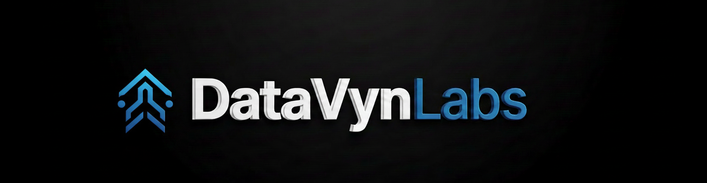

<p align="center">
  
</p>

<p align="center">
  A clean, minimal AI chat interface powered by <strong>Ollama Cloud Models</strong>
</p>

<p align="center">
  <a href="https://github.com/DataVyn-labs">DataVyn Labs</a> ·
  <a href="https://ollama.com">Ollama</a> ·
  Built with Streamlit
</p>

---


## Features

| | Feature | Details |
|---|---|---|
| 🤖 | **Cloud Models** | 19 verified Ollama cloud models from OpenAI, DeepSeek, Qwen, Gemini, Mistral, Kimi, GLM, MiniMax and more |
| ⚡ | **Streaming** | Responses stream token by token in real time |
| 🎨 | **Model Avatars** | Each AI shows its company logo in chat (ChatGPT, DeepSeek, Gemini, Mistral...) |
| 📎 | **File Upload** | Attach `.txt` `.pdf` `.json` `.py` `.csv` — content sent to the model |
| 🎙 | **Audio Input** | Record voice via mic, auto-transcribed to text |
| 🔐 | **Secure Login** | API key stored in session only — never saved to disk |
| 🌑 | **Dark UI** | Clean Claude.ai-style dark theme with Inter font |

---

## Quick Start

### 1. Clone the project

```bash
git clone https://github.com/anshk1234/DataVyn-Labs-X-Ollama-agents
cd ollama-agent
```

### 2. Install dependencies

```bash
pip install -r requirements.txt
```

### 3. Run

```bash
streamlit run app.py
```

Open [http://localhost:8501](http://localhost:8501) in your browser.

---

## Getting an Ollama API Key

1. Go to [ollama.com](https://ollama.com) and create a free account
2. Navigate to **Settings → API Keys**
3. Click **Create new key**
4. Paste it into the app login screen

---

## Available Cloud Models

| Model | ID | Company |
|---|---|---|
| GPT-OSS 120B | `gpt-oss:120b` | OpenAI (open weights) |
| GPT-OSS 20B | `gpt-oss:20b` | OpenAI (open weights) |
| DeepSeek V3.2 | `deepseek-v3.2` | DeepSeek |
| DeepSeek V3.1 671B | `deepseek-v3.1:671b` | DeepSeek |
| Qwen3-Coder 480B | `qwen3-coder:480b` | Alibaba |
| Qwen3-Coder-Next | `qwen3-coder-next` | Alibaba |
| Qwen3-Next 80B | `qwen3-next:80b` | Alibaba |
| Kimi K2.5 | `kimi-k2.5` | Moonshot AI |
| Kimi K2 Thinking | `kimi-k2-thinking` | Moonshot AI |
| Gemini 3 Flash Preview | `gemini-3-flash-preview` | Google |
| MiniMax M2.5 | `minimax-m2.5` | MiniMax |
| MiniMax M2.1 | `minimax-m2.1` | MiniMax |
| MiniMax M2 | `minimax-m2` | MiniMax |
| GLM-5 | `glm-5` | Zhipu AI |
| GLM-4.7 | `glm-4.7` | Zhipu AI |
| Devstral 2 123B | `devstral-2:123b` | Mistral |
| Devstral Small 2 24B | `devstral-small-2:24b` | Mistral |
| Cogito 2.1 671B | `cogito-2.1:671b` | Essential AI |
| Nemotron 3 Nano 30B | `nemotron-3-nano:30b` | NVIDIA |

Full list → [ollama.com/search?c=cloud](https://ollama.com/search?c=cloud)

---

## Configuration

Edit these constants at the top of `app.py` (~line 337):

```python
TEMPERATURE = 0.6    # 0.0 = focused  |  1.0 = creative
MAX_TOKENS  = 1200   # max tokens per response (hard cap: 2000)
```

---

## Project Structure

```
datavynlabs_agent/
├── app.py            # Main Streamlit application
├── logo.png          # DataVyn Labs logo
├── requirements.txt  # Python dependencies
└── README.md         # This file
```

---

## Requirements

```
streamlit>=1.43.0
requests>=2.31.0
```

---

## Notes

- API key is stored **in session memory only** — cleared on sign out or tab close
- Audio input (`accept_audio=True`) requires **Streamlit 1.43+** — run `pip install --upgrade streamlit` if needed
- Uploaded file content is truncated to **4 000 characters** before being sent to the model
- All model requests go through `https://ollama.com/api/chat`
- System prompt instructs the model to give concise, complete answers within the token limit

---

## About DataVyn Labs

**DataVyn Labs** builds intelligent data automation and AI agent tools for modern teams.

🔗 [github.com/DataVyn-labs](https://github.com/DataVyn-labs)

---

*© 2026 DataVyn Labs*

